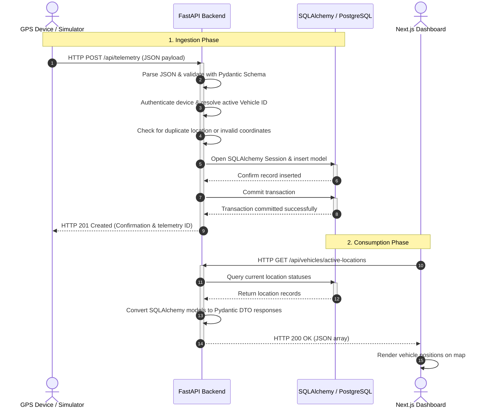

# Vehicle Tracking System (VTS) - End-to-End Data Flow

This document details the end-to-end data flow architecture of the Vehicle Tracking System (VTS). It serves as technical onboarding documentation for developers to understand how data moves through the system, the division of responsibilities among components, the design rationale behind our decoupled layers, and how we ensure reliability, security, and scalability.

---

## Architectural Philosophy & Overview

Our VTS handles telemetry data originating from vehicles (which could be simulated, actual ESP32/GPS microcontrollers, or commercial GPS trackers) and makes it available to dashboards, reporting tools, and analytics interfaces. 

A core tenet of this architecture is **strict decoupling**:
1. **IoT / Device Layer:** Independent of backend data representation or storage.
2. **Application / Business Layer:** The single source of truth for schema validation, authentication, business rules, and state transformation.
3. **Storage / ORM Layer:** Governs safe access, transactions, and relational mapping to PostgreSQL.
4. **Presentation / API Layer:** Consumes aggregated, validated states via standard REST APIs.

### Architecture Topology

```
   ┌─────────────────────────────────────────────────────────────┐
   │        Vehicle Simulators / ESP32 Devices / GPS Trackers     │
   └──────────────────────────────┬──────────────────────────────┘
                                  │
                                  │ HTTP Request (POST /telemetry)
                                  ▼
   ┌─────────────────────────────────────────────────────────────┐
   │                       FastAPI Backend                       │
   │       (Authentication, Validation, Business Logic, DTOs)    │
   └──────────────────────────────┬──────────────────────────────┘
                                  │
                                  │ Session Operations / DB Models
                                  ▼
   ┌─────────────────────────────────────────────────────────────┐
   │                     SQLAlchemy ORM Layer                    │
   │                  (Transactions, CRUD, Pools)                │
   └──────────────────────────────┬──────────────────────────────┘
                                  │
                                  │ SQL Queries / DDL
                                  ▼
   ┌─────────────────────────────────────────────────────────────┐
   │                     PostgreSQL Database                     │
   │         (Tables: Vehicles, Locations, Drivers, Trips)       │
   └──────────────────────────────▲──────────────────────────────┘
                                  │
                                  │ Fetch Queries via Backend API
                                  ▼
   ┌─────────────────────────────────────────────────────────────┐
   │                  Next.js Web Dashboard / UI                 │
   │               (Visualizations, Map tracking, Logs)          │
   └─────────────────────────────────────────────────────────────┘
```

---

## Layer-by-Layer Breakdown

### 1. Vehicle Simulator (Device Layer)
The device layer is represented in this project by [telemetry_simulator.py](file:///e:/Embedded%20Projects/GPS_Project/scripts/telemetry_simulator.py). In production, this layer is replaced by physical GPS trackers, GSM trackers, or ESP32-based hardware.

- **Telemetry Fields Generated:**
  - `device_id` (UUID or unique hardware identifier): Identifies which vehicle sent the packet.
  - `latitude` & `longitude`: Geolocation coordinates.
  - `speed`: Speed in km/h or knots.
  - `heading`: Direction of travel in degrees (0–360).
  - `ignition`: Boolean flag representing if the vehicle's engine is running.
  - `timestamp`: UTC ISO-8601 timestamp of when the telemetry packet was captured.
- **Architectural Constraints:**
  - **No Direct Database Access:** GPS devices are deployable hardware targets. They lack secure credentials, can be compromised, and operate on unstable network connections. They must never directly touch database instances.
  - **Minimal Payload State:** Devices transmit raw telemetry payloads and receive simple HTTP status codes (`200 OK` or `201 Created` / `400 Bad Request`).

### 2. FastAPI Backend (Application Layer)
The FastAPI backend ([main.py](file:///e:/Embedded%20Projects/GPS_Project/app/main.py)) acts as the gatekeeper and brain of the entire tracking infrastructure. Every operation must pass through this layer.

- **Core Responsibilities:**
  - **API Routing:** Directs incoming HTTP requests to corresponding controller paths in [routers/](file:///e:/Embedded%20Projects/GPS_Project/app/routers).
  - **Input Validation:** Enforces structural and type constraints on JSON payloads using Pydantic schemas in [schemas/](file:///e:/Embedded%20Projects/GPS_Project/app/schemas).
  - **Authentication & Security:** Inspects headers for access tokens or device-specific authentication keys to ensure valid registration.
  - **Duplicate Detection & Filter Rules:** Filters out noisy telemetry packets (e.g., identical coordinates when stationary) to prevent database bloat.
  - **Data Translation (DTO to Entity):** Unpacks verified Pydantic schema objects (DTOs) and builds corresponding database models defined in [models/](file:///e:/Embedded%20Projects/GPS_Project/app/models).
  - **Structured Logging:** Emits telemetry processing logs (via [logging_config.py](file:///e:/Embedded%20Projects/GPS_Project/app/logging_config.py)) for monitoring system health and debugging.

### 3. SQLAlchemy Layer (ORM & Transactions)
SQLAlchemy acts as our Object-Relational Mapper (ORM), bridging Python code and relational database tables.

- **Core Responsibilities:**
  - **Session Management:** Manages transaction scopes per HTTP request. SQLAlchemy sessions are injected as dependencies into route controllers.
  - **SQL Generation:** Translates object manipulations (`session.add()`, query filters) into syntax-correct SQL queries tailored to PostgreSQL.
  - **Transactional Integrity:** Handles `session.commit()` to finalize operations and `session.rollback()` in the event of processing or database errors, preventing corrupt or half-written states.
  - **Connection Pooling:** Controls database connection limits efficiently, recycling connections under heavy load.

### 4. PostgreSQL (Storage Layer)
The target relational database storing persistent configuration, vehicle information, and raw telemetry history.

- **Primary Entities:**
  - **Vehicles:** Static and dynamic metadata mapping `device_id` to license plates, make, model, and active status.
  - **Locations (Telemetry):** Log of geographical points mapped back to specific vehicles.
  - **Drivers & Assignments:** Identifies who was operating which vehicle at any given timestamp.
  - **Trips:** Summarized travel segments containing start times, end times, total distance, and average speed.
- **Security & Integrity Constraints:**
  - Placed behind a private subnet inside a Virtual Private Cloud (VPC) in production.
  - Only accepts incoming TCP traffic from the FastAPI Backend instances.

### 5. Next.js Dashboard (Presentation Layer)
The dashboard ([dashboard/](file:///e:/Embedded%20Projects/GPS_Project/dashboard)) presents real-time and historical analytics to fleet managers.

- **Core Responsibilities:**
  - **No Direct Telemetry Ingestion:** The dashboard does not listen to incoming GPS tracker requests.
  - **Backend API Querying:** Queries the backend GET endpoints (e.g., `/api/vehicles/`, `/api/vehicles/{id}/locations/`) to fetch data.
  - **Rendering & Visualization:** Renders vehicle locations on interactive maps, charts out speed profiles, and lists active alarms or trip reports.

---

## Detailed Step-by-Step Request Flow

The sequence diagram below displays how a single telemetry payload moves from a device to persistence, and is subsequently requested by the web dashboard:



---

## Folder Mapping

Our data flow maps directly to the project folder structure. Follow the path below to see how a telemetry packet flows from script execution to the database:

```text
scripts/telemetry_simulator.py (Generates & dispatches payload)
         │
         ▼ HTTP POST
app/main.py (Application entry point)
         │
         ▼ Route selection
app/routers/ (Handles API routes e.g., locations.py)
         │
         ▼ Payload verification
app/schemas/ (Validates shapes using Pydantic DTOs e.g., location.py)
         │
         ▼ Business Rules & Verification
app/services/ (Computes trips, updates status caches)
         │
         ▼ Persistence abstraction
app/crud/ (Performs database CRUD operations)
         │
         ▼ SQLAlchemy Model Mapping
app/models/ (Defines DB schemas e.g., location.py, vehicle.py)
         │
         ▼ DB engine session execution
app/database.py (Manages DB engine, sessionmaker, metadata)
         │
         ▼ SQL Protocol
PostgreSQL Database (Performs physical write to disk)
```

---

## Benefits of This Architecture

* **Scalability:** By keeping the FastAPI backend stateless, we can spin up multiple instances behind a load balancer to handle millions of concurrent GPS pings.
* **Robust Security:** GPS devices only have access to a single ingestion API endpoint. The database sits securely in a private network, minimizing the attack surface.
* **Data Consistency:** The backend serves as the single source of truth. Rules regarding what constitutes a valid coordinate, speed value, or ignition state are maintained in code, rather than spread across database triggers or device firmware.
* **Maintainability & Clean Separation of Concerns:** Database changes do not break GPS hardware configurations. Hardware upgrades or changes in communication protocols (like switching HTTP to MQTT) only require adjusting the backend ingestion layer, leaving the database and frontend intact.
* **Testing:** Components can be easily unit-tested. Database interactions are mocked using SQLAlchemy test sessions, and router validation is verified using FastAPI's `TestClient`.

---

## Architecture Violations (Common Anti-Patterns)

To maintain a clean codebase, avoid these anti-patterns:

### ❌ Anti-Pattern 1: Simulator → PostgreSQL
Connecting GPS devices directly to the database.
* **Why it is bad:** Requires exposing the database port (`5432`) to the public internet, posing a catastrophic security risk. Additionally, IoT devices cannot run migrations, easily format SQL statements, or handle database connection pools efficiently.

### ❌ Anti-Pattern 2: Dashboard → PostgreSQL
Allowing the Next.js frontend to query the database directly.
* **Why it is bad:** Bypasses backend security controls, role-based access check (RBAC), and schema validation. If the database schema changes, the frontend code breaks.

### ❌ Anti-Pattern 3: Simulator → Dashboard
Devices attempting to send data directly to the frontend via peer-to-peer mechanisms.
* **Why it is bad:** Bypasses data persistence entirely. If the dashboard user closes their browser, the telemetry data is lost forever.

### ❌ Anti-Pattern 4: Multiple components writing directly to the database
Allowing multiple systems or external microservices to execute raw SQL insert/update commands against the main schema bypassing the API.
* **Why it is bad:** Creates race conditions, bypasses business logic, limits schema refactoring capabilities, and corrupts transactional consistency.

---

## Future Infrastructure Expansion

This modular architecture is designed to support the following infrastructure expansions without requiring structural rewrites:

```
                  ┌──────────────────────┐
                  │ MQTT / CoAP / GSM    │ (Low bandwidth protocols)
                  └──────────┬───────────┘
                             │
                             ▼
 ┌──────────┐     ┌──────────────────────┐     ┌──────────────┐
 │ Kafka /  │◄────┤  Ingestion Microservice │────►│ Redis Cache  │ (Fast status updates)
 │ RabbitMQ │     └──────────────────────┘     └──────────────┘
 └────┬─────┘
      │
      ▼
 ┌────┴─────────────────┐     ┌────────────────────────┐
 │ FastAPI Worker Pool  │────►│ PostgreSQL / Timescale │ (Optimized timeseries storage)
 └──────────────────────┘     └────────────────────────┘
```

1. **Alternative Communication Protocols (MQTT, CoAP, GSM):** Introduce an **MQTT Broker** (e.g., VerneMQ, EMQX) or **CoAP** gateway for low-bandwidth cellular trackers. An ingestion worker can listen to MQTT topics and forward payloads to the existing FastAPI services.
2. **Message Queuing & Buffering (Kafka / RabbitMQ):** Handle spikes in traffic by routing raw payloads directly to a message queue, buffering writes to PostgreSQL.
3. **Redis Caching:** Cache the "last known position" of vehicles in Redis. The dashboard can query Redis instantly instead of running intensive table scans on PostgreSQL telemetry logs.
4. **Real-time Subscriptions (WebSockets):** Implement a WebSocket gateway in the backend to stream location updates directly to the Next.js dashboard as they are received.
5. **Scale & Orchestration:** Deploy FastAPI instances within **Kubernetes (K8s)** to autoscale based on CPU utilization and incoming device connections.
6. **Cloud Infrastructure:** Host the database on managed instances like AWS RDS (with TimescaleDB extension for telemetry aggregation) and run containerized API instances on AWS ECS or EKS.

---

## Summary

The complete production data flow is defined as:

$$\text{Vehicle} \longrightarrow \text{Backend} \longrightarrow \text{Database} \longrightarrow \text{Backend} \longrightarrow \text{Dashboard}$$

This architecture mirrors standard backend designs used in modern industrial IoT platforms, fleet management systems, and commercial Vehicle Tracking Systems, ensuring security, scalability, maintainability, and clean separation of responsibilities.
