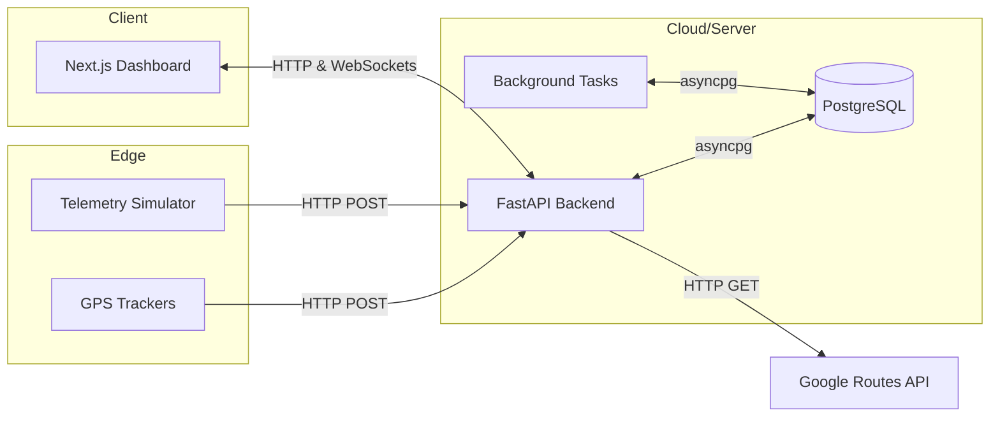
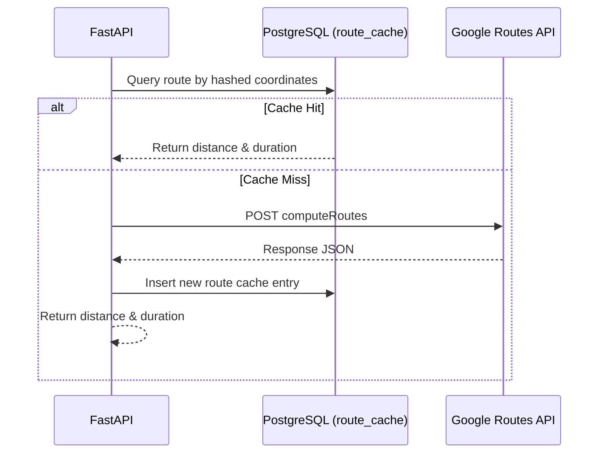
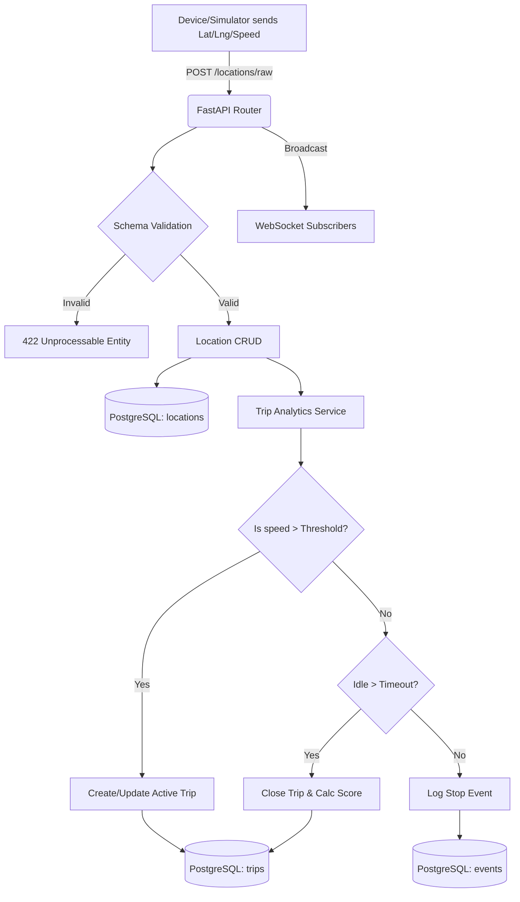

# System Architecture

This document describes the high-level architecture of the Welogical Vehicle Tracking System, detailing how data flows from physical GPS devices through the backend processing pipeline and into the user interface.

## 1. High-Level Architecture

The system follows a classic decoupled 3-tier architecture:
1. **Frontend (Presentation Layer):** Next.js 15 application.
2. **Backend (Application Layer):** FastAPI Python server.
3. **Database (Data Layer):** PostgreSQL accessed via asyncpg.

---

## 2. Component Interactions

### 2.1 Telemetry Ingestion
- **Input:** GPS hardware (or simulator) sends JSON payloads containing `device_uid`, `latitude`, `longitude`, `speed`, and `timestamp` to `/api/v1/locations/raw`.
- **Validation:** Pydantic schemas immediately validate the payload structure and data types.
- **Storage & Broadcast:** Validated packets are inserted into the database and streamed in real-time to active WebSocket subscribers.

### 2.2 Trip & Event Processing
Trip logic is triggered upon receiving locations or handled via background tasks.
- **Trip Analytics (`trip_analytics.py`):**
  - **Start:** If a vehicle's speed exceeds `TRIP_START_SPEED_THRESHOLD` and no active trip exists, a new `Trip` record is created.
  - **Stop Detection:** If speed drops below `TRIP_STOP_SPEED` for `TRIP_STOP_DURATION`, a stop event is logged.
  - **End:** If the vehicle stops moving for `TRIP_END_TIMEOUT`, the active trip is closed.
- **Trip Scoring (`trip_scoring.py`):**
  - Starts at 100 points.
  - Deducts points for every Overspeed event (`DRIVING_SCORE_OVERSPEED_PENALTY`).
  - Deducts points for every Long Idle event (`DRIVING_SCORE_IDLE_PENALTY`).
  - Updates the final `driving_score` on the `Trip` record.

### 2.3 External Integrations (Google Routes)
- **Purpose:** To calculate accurate driving distance and duration between two GPS coordinates, overcoming the inaccuracies of straight-line (Haversine) distances.
- **Flow:**
  - Backend checks the `route_cache` table for existing coordinate pairs (normalized to 5 decimal places).
  - If a cache miss occurs, an HTTP request is made to the Google Routes API (`googleapis.com/directions/v2:computeRoutes`).
  - The result (distance in meters, duration in seconds) is saved to `route_cache` and returned to the caller.

---

## 3. Data Flow Diagram

---

## 4. Frontend Architecture

The frontend uses Next.js 15 (App Router).
- **Server Components:** Used for initial page loads and fetching layout data to improve SEO and load times.
- **Client Components:** Used for interactive elements (Maps, Charts, Live Tracking tables) requiring React hooks (`useState`, `useEffect`).
- **State Management:** Centralized globally using the React Context API (`FleetProvider` inside `dashboard/context/FleetContext.tsx`). This provider establishes a persistent WebSocket connection to stream real-time updates and update states (vehicles, snapshots, events) on the fly without manual polling.
- **Styling:** Utility-first styling via Tailwind CSS, avoiding complex CSS file bloat.
