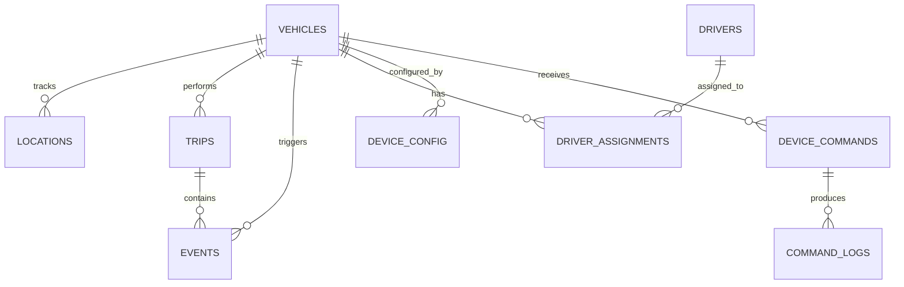

# Database Schema

This document details the PostgreSQL relational database schema used by the Vehicle Tracking System. The schema is managed via SQLAlchemy ORM and Alembic migrations.

## 1. Entity Relationship Overview



---

## 2. Core Tables

### 2.1 `vehicles`
Stores physical tracking devices or trucks.
- `id` (Integer, Primary Key)
- `device_uid` (String, Unique) - The hardware ID of the GPS tracker.
- `vehicle_name` (String) - Human-readable name.
- `vehicle_type` (String) - e.g., Truck, Van, Car.
- `status` (String) - Enabled, Disabled.

### 2.2 `locations` & `raw_packets`
- **`raw_packets`**: Unprocessed, raw JSON string payload directly from the device for audit logging.
- **`locations`**: High-frequency GPS pings.
  - `id` (Integer, Primary Key)
  - `vehicle_id` (Integer, Foreign Key -> vehicles.id)
  - `latitude`, `longitude`, `speed`, `altitude` (Float)
  - `timestamp` (DateTime)
  - `extra_data` (JSONB) - Holds extra status values (e.g. `{'io': ..., 'pwr': ...}`)

### 2.3 `trips`
Represents a continuous journey. Created and finalized dynamically.
- `id` (Integer, Primary Key)
- `vehicle_id` (Integer, Foreign Key -> vehicles.id)
- `start_time`, `end_time` (DateTime)
- `start_location_lat`, `start_location_lng` (Float)
- `distance_km` (Float)
- `driving_score` (Integer) - 0 to 100 score based on infractions.
- `is_active` (Boolean)

### 2.4 `events`
Stores significant occurrences (infractions, system events).
- `id` (Integer, Primary Key)
- `vehicle_id` (Integer, Foreign Key -> vehicles.id)
- `trip_id` (Integer, Foreign Key -> trips.id, Nullable)
- `event_type` (String) - `OVERSPEED`, `LONG_IDLE`, `STOP`.
- `timestamp` (DateTime)
- `event_metadata` (JSONB) - Event specifics (e.g., `{"speed": 85}`).

### 2.5 `drivers` & `driver_assignments`
Manages personnel and their temporary association with vehicles.
- **`drivers`**: Stores `driver_name`, `license_number`, `status`.
- **`driver_assignments`**: Junction table mapping `driver_id` and `vehicle_id` with `assigned_at` and `released_at` timestamps.

### 2.6 `route_cache`
Caches responses from the Google Routes API to minimize external API costs.
- `id` (Integer, Primary Key)
- `cache_key` (String, Unique) - MD5 hash lookup of normalized routing endpoints.
- `distance_meters`, `duration_seconds` (Integer)
- `encoded_polyline` (String)

### 2.7 `device_config`, `device_commands`, `command_logs`
Manages Over-The-Air (OTA) configurations and executions.
- **`device_config`**: Stores key-value parameters (`parameter`, `value`) for a `vehicle_id`.
- **`device_commands`**: Queue of commands (`command_type`, `payload`) to send.
- **`command_logs`**: History of executed commands (`status`, `response`).

---

## 3. Migrations

Database schema changes are managed by **Alembic**.

**Useful Commands:**
- Generate a new migration after changing a model in `app/models/`:
  ```bash
  alembic revision --autogenerate -m "added new column to vehicles"
  ```
- Apply migrations to the database:
  ```bash
  alembic upgrade head
  ```

*Note: Migrations must be run before starting the FastAPI server for the first time.*
